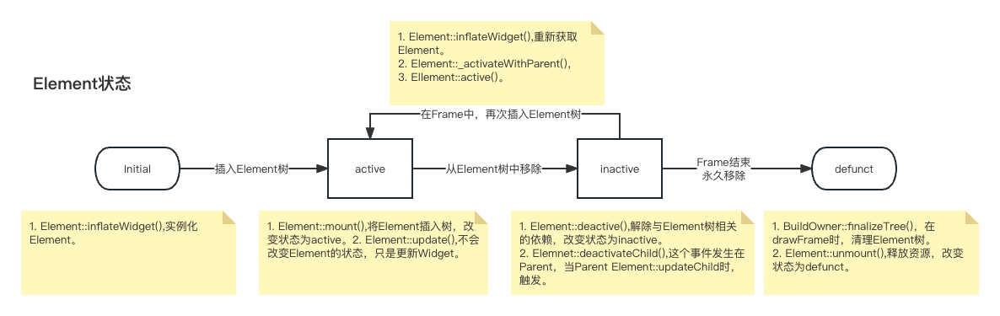
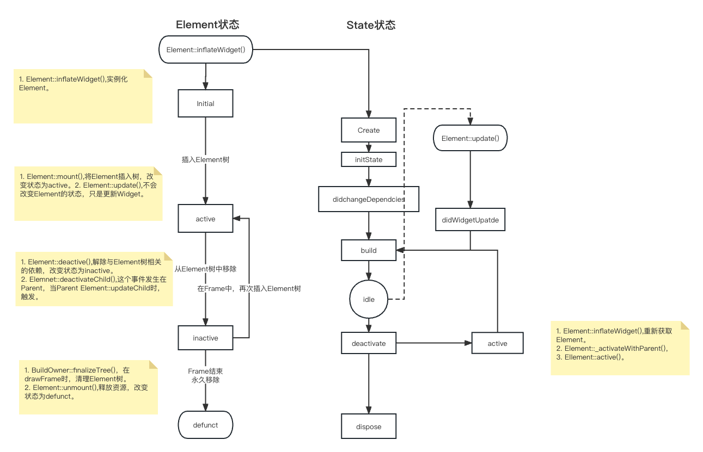

# 生命周期
Element不仅维护Element树，同时还负责维护Render树。所以无论是State生命周期，还是Element生命周期，或者RenderObject生命周期，都是由Element来维护。Element有很多类型，如ComponentElement，RenderObjectElement等，他们在Element生命周期的基础上有不同的扩展，以此来hook State生命周期，RenderObject生命周期。

## Element生命周期
最基础的Element生命周期很简单，只有四种状态：`initial`,`active`,`inactive`,`defunct`.

1. **initial** : Element的默认状态。
2. **active** : 当Element被插入Element树后的状态，当插入完成，当前Element对应的RenderObject也会被插入树中。
3. **inactive** : 当Element被移除Element树后的状态，移除完成时，当前Element对应的RenderObject也会被从Render树移除。
4. **defunct** : Element彻底不可用。当inactive的Element没有在当前frame从新被插入树中触发。

`initial`和`defunct`状态存在的时间都非常短，我们没有机会观察到处于`initial`状态的Element，因为Framework在创建Element后会立即插入。而`defunct`状态的Element也不存在任何可达引用，会被垃圾收集器回收。

`inactive`状态只存在于drawframe期间，在drawFrame后，要么从新插入树=>`active`，要么彻底移除=>`defunct`.

`active`状态是停留在树中时的状态，所有可见元素都是这个状态。

## State生命周期
State的生命周期依赖于Element生命周期，由StatefulElement传递生命周期hook到State。

Element.mount() => _firstBuild() => {initState();didChangeDependencies();}
Element.unmount() => state.dispose();
Element.deactivate() => state.deactivate();
Element.update()=>DidUpdateWidget;

1. Create: 实例化State，一般我们不关心这个生命周期回调。创建完State后，Element才完成实例化。
2. InitState: 在Element被挂载到树时触发，一般用于初始化数据，在整个Element生命周期，只会触发一次。
3. Dependencies：第一次在Element挂载时触发， 后续随着依赖的InheritedWidget发生改变时触发，所以在这里查询InheritedWidget数据是合适的。一般我们也可以在build中查询，毕竟didChangeDependencies后一定会build。但是如果是耗时工作，最好不要放在build。
4. build：构建Widget树，没啥说的。
5. DidUpdateWidget：使用新的Widget更新Element时触发。后面一定会触发build。
6. Deactivate：当Element从树中移除是触发。
7. Activate：当Element重新插入树中时触发。
8. Dispose： 当Element被永久移除是触发。

## RenderObject生命周期

Element.mount() => createRenderObject

Element.mount() => attachRenderObject

1. create
2. layout
3. paint
4. repaint
5. destory
