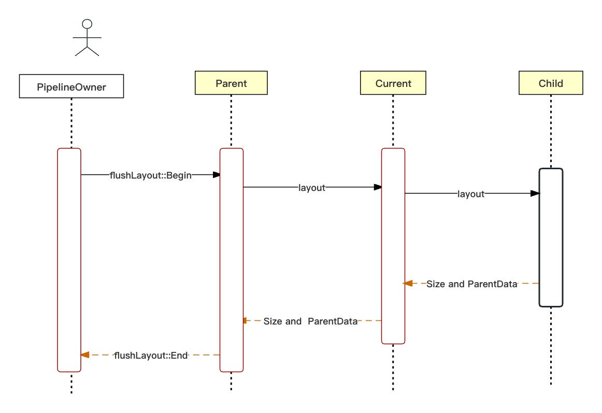

# 布局流程
Flutter 的布局过程发生在Render树。由RendererBinding的drawFrame函数触发。这个函数在每次更新帧时被调用。

```
--- pipelineOwner.flushLayout();
----- node._layoutWithoutResize()；
------- performLayout();
```

布局过程会计算出每个RenderBox的Size，如果有必要还会记录每个child的ParentData数据（如offset）。

## layout过程在Render树中的流动

主线是依据constraints计算Size。



每次Parent Layout时，会先测量Child，此时会将对Child的约束传递给Child。不同类型的Parent计算约束的方式不一样，
如RenderPadding，会根据自己的约束，配置Padding参数来计算给Child的约束，如RenderFlex，会根据自己的约束，其他Child的大小，Child的Flex来给Child传递约束。在约束添加下（盒子布局为最大最小宽高约束条件），child会计算出自己的size，并向上传递。知道完成整颗树的布局测试。

在Layout过程中，同时也会确定ParentData，如RenderPadding的Child会保持offset信息，RenderFlex的Child会保存flex、fit等信息，看具体父节点类型的需要。parentData既可以被当前节点使用，也可以被父节点使用，但不能越级使用，级祖先节点不能使用孙子节点的ParentData。
