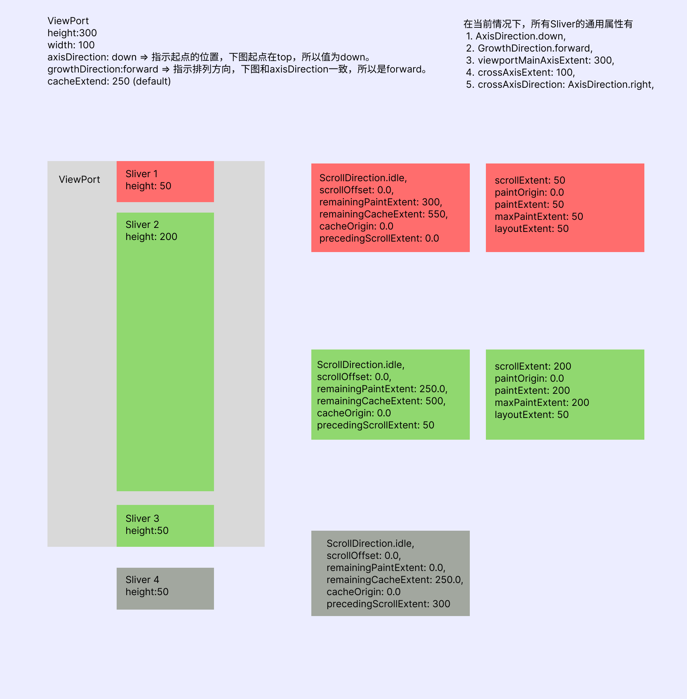

# Viewport

Viewport 是 Sliver 布局的起点，也是滚动机制的重要组成部分。作为滚动视窗，他也是用户滚动和 Sliver 展示联动的桥梁。

## 如何测量 Sliver

核心方法是 layoutChildSequence，起点是\_attemptLayout。

\_attemptLayout：

```
double _attemptLayout(double mainAxisExtent, double crossAxisExtent, double correctedOffset) {
    assert(!mainAxisExtent.isNaN);
    assert(mainAxisExtent >= 0.0);
    assert(crossAxisExtent.isFinite);
    assert(crossAxisExtent >= 0.0);
    assert(correctedOffset.isFinite);
    _minScrollExtent = 0.0;
    _maxScrollExtent = 0.0;
    _hasVisualOverflow = false;

    // centerOffset is the offset from the leading edge of the RenderViewport
    // to the zero scroll offset (the line between the forward slivers and the
    // reverse slivers).
    final double centerOffset = mainAxisExtent * anchor - correctedOffset;
    final double reverseDirectionRemainingPaintExtent = clampDouble(centerOffset, 0.0, mainAxisExtent);
    final double forwardDirectionRemainingPaintExtent = clampDouble(mainAxisExtent - centerOffset, 0.0, mainAxisExtent);

    switch (cacheExtentStyle) {
      case CacheExtentStyle.pixel:
        _calculatedCacheExtent = cacheExtent;
      case CacheExtentStyle.viewport:
        _calculatedCacheExtent = mainAxisExtent * _cacheExtent;
    }

    final double fullCacheExtent = mainAxisExtent + 2 * _calculatedCacheExtent!;
    final double centerCacheOffset = centerOffset + _calculatedCacheExtent!;
    final double reverseDirectionRemainingCacheExtent = clampDouble(centerCacheOffset, 0.0, fullCacheExtent);
    final double forwardDirectionRemainingCacheExtent = clampDouble(fullCacheExtent - centerCacheOffset, 0.0, fullCacheExtent);

    final RenderSliver? leadingNegativeChild = childBefore(center!);

    if (leadingNegativeChild != null) {
      // negative scroll offsets
      final double result = layoutChildSequence(
        child: leadingNegativeChild,
        scrollOffset: math.max(mainAxisExtent, centerOffset) - mainAxisExtent,
        overlap: 0.0,
        layoutOffset: forwardDirectionRemainingPaintExtent,
        remainingPaintExtent: reverseDirectionRemainingPaintExtent,
        mainAxisExtent: mainAxisExtent,
        crossAxisExtent: crossAxisExtent,
        growthDirection: GrowthDirection.reverse,
        advance: childBefore,
        remainingCacheExtent: reverseDirectionRemainingCacheExtent,
        cacheOrigin: clampDouble(mainAxisExtent - centerOffset, -_calculatedCacheExtent!, 0.0),
      );
      if (result != 0.0) {
        return -result;
      }
    }

    // positive scroll offsets
    return layoutChildSequence(
      child: center,
      scrollOffset: math.max(0.0, -centerOffset),
      overlap: leadingNegativeChild == null ? math.min(0.0, -centerOffset) : 0.0,
      layoutOffset: centerOffset >= mainAxisExtent ? centerOffset: reverseDirectionRemainingPaintExtent,
      remainingPaintExtent: forwardDirectionRemainingPaintExtent,
      mainAxisExtent: mainAxisExtent,
      crossAxisExtent: crossAxisExtent,
      growthDirection: GrowthDirection.forward,
      advance: childAfter,
      remainingCacheExtent: forwardDirectionRemainingCacheExtent,
      cacheOrigin: clampDouble(centerOffset, -_calculatedCacheExtent!, 0.0),
    );
  }
```

layoutChildSequence：

```
double layoutChildSequence({
    required RenderSliver? child,
    required double scrollOffset,
    required double overlap,
    required double layoutOffset,
    required double remainingPaintExtent,
    required double mainAxisExtent,
    required double crossAxisExtent,
    required GrowthDirection growthDirection,
    required RenderSliver? Function(RenderSliver child) advance,
    required double remainingCacheExtent,
    required double cacheOrigin,
  }) {
    assert(scrollOffset.isFinite);
    assert(scrollOffset >= 0.0);
    final double initialLayoutOffset = layoutOffset;
    final ScrollDirection adjustedUserScrollDirection =
        applyGrowthDirectionToScrollDirection(offset.userScrollDirection, growthDirection);
    double maxPaintOffset = layoutOffset + overlap;
    double precedingScrollExtent = 0.0;

    while (child != null) {
      final double sliverScrollOffset = scrollOffset <= 0.0 ? 0.0 : scrollOffset;
      // If the scrollOffset is too small we adjust the paddedOrigin because it
      // doesn't make sense to ask a sliver for content before its scroll
      // offset.
      final double correctedCacheOrigin = math.max(cacheOrigin, -sliverScrollOffset);
      final double cacheExtentCorrection = cacheOrigin - correctedCacheOrigin;

      assert(sliverScrollOffset >= correctedCacheOrigin.abs());
      assert(correctedCacheOrigin <= 0.0);
      assert(sliverScrollOffset >= 0.0);
      assert(cacheExtentCorrection <= 0.0);

      child.layout(SliverConstraints(
        axisDirection: axisDirection,
        growthDirection: growthDirection,
        userScrollDirection: adjustedUserScrollDirection,
        scrollOffset: sliverScrollOffset,
        precedingScrollExtent: precedingScrollExtent,
        overlap: maxPaintOffset - layoutOffset,
        remainingPaintExtent: math.max(0.0, remainingPaintExtent - layoutOffset + initialLayoutOffset),
        crossAxisExtent: crossAxisExtent,
        crossAxisDirection: crossAxisDirection,
        viewportMainAxisExtent: mainAxisExtent,
        remainingCacheExtent: math.max(0.0, remainingCacheExtent + cacheExtentCorrection),
        cacheOrigin: correctedCacheOrigin,
      ), parentUsesSize: true);

      final SliverGeometry childLayoutGeometry = child.geometry!;
      assert(childLayoutGeometry.debugAssertIsValid());

      // If there is a correction to apply, we'll have to start over.
      if (childLayoutGeometry.scrollOffsetCorrection != null) {
        return childLayoutGeometry.scrollOffsetCorrection!;
      }

      // We use the child's paint origin in our coordinate system as the
      // layoutOffset we store in the child's parent data.
      final double effectiveLayoutOffset = layoutOffset + childLayoutGeometry.paintOrigin;

      // `effectiveLayoutOffset` becomes meaningless once we moved past the trailing edge
      // because `childLayoutGeometry.layoutExtent` is zero. Using the still increasing
      // 'scrollOffset` to roughly position these invisible slivers in the right order.
      // @1
      if (childLayoutGeometry.visible || scrollOffset > 0) {
        updateChildLayoutOffset(child, effectiveLayoutOffset, growthDirection);
      } else {
        updateChildLayoutOffset(child, -scrollOffset + initialLayoutOffset, growthDirection);
      }
      //@3
      maxPaintOffset = math.max(effectiveLayoutOffset + childLayoutGeometry.paintExtent, maxPaintOffset);
      //@2
      scrollOffset -= childLayoutGeometry.scrollExtent;
      //@4
      precedingScrollExtent += childLayoutGeometry.scrollExtent;
      layoutOffset += childLayoutGeometry.layoutExtent;
      if (childLayoutGeometry.cacheExtent != 0.0) {
        remainingCacheExtent -= childLayoutGeometry.cacheExtent - cacheExtentCorrection;
        cacheOrigin = math.min(correctedCacheOrigin + childLayoutGeometry.cacheExtent, 0.0);
      }

      updateOutOfBandData(growthDirection, childLayoutGeometry);

      // move on to the next child
      child = advance(child);
    }

    // we made it without a correction, whee!
    return 0.0;
  }
```


使用 child 的 SliverGeometry 更新的属性有：

1.  child 的 ParentData 的 paintOffset：在@1 处，根据局部变量 layoutOffset 和自身绘制偏移。
2.  layoutOffset：在@2 处，累加`layoutExtent` 。
3.  maxPaintOffset：在@3 处，累加`paintExtent`。会附加一些逻辑。
4.  precedingScrollExtent：在@4 处，累加`scrollExtent`。
5.  overlap：maxPaintOffset - layoutOffset，当 layoutExtent 和 paintExtent 不一致时，不为 0。




## RenderViewport

ViewPort 渲染对象

```
RenderViewport {
    /// layout驱动，携带偏移信息。
    ViewportOffset _offset;

    /// SliverConstraints.axisDirection
    AxisDirection _axisDirection;


    double _cacheExtent;


}
```
