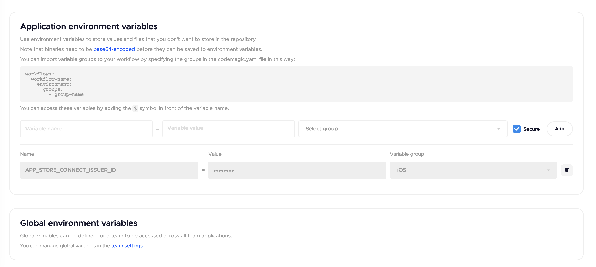
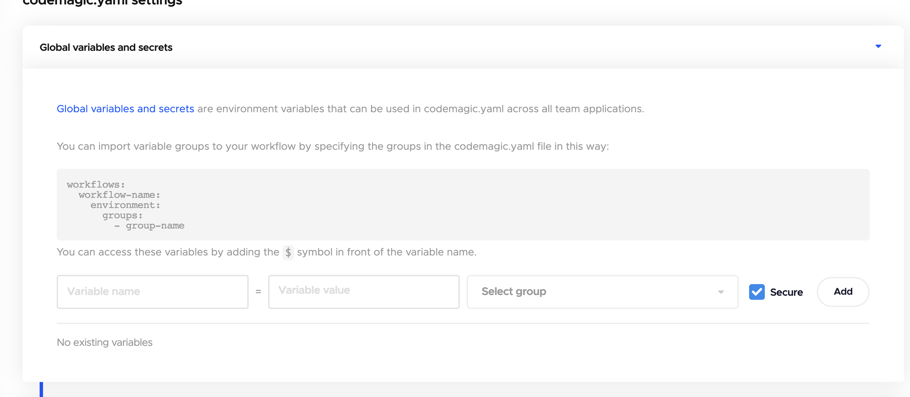

# CI/CD

* Continuous Integration (CI)：持续集成。提交给应用程序(甚至是开发分支)的每个更改都是自动且持续地构建和测试的。这些测试确保更改通过为应用程序建立的所有测试、指导方针和代码遵从标准。
* Continuous Delivery (CD)：持续交付是超越持续集成的一步。每次将代码更改推入代码库时，不仅要构建和测试应用程序，而且还要持续部署应用程序。然而，对于持续交付，您需要手动触发部署。
* Continuous Deployment (CD)：持续部署是持续集成之外的另一个步骤，类似于持续交付。不同之处在于，您不必手动部署应用程序，而是将其设置为自动部署。不需要人工干预。

* CodeMagic： 一个基于云端的构建、分发平台，主要为移动端项目服务。


## CD（基于CodeMagic）
首先需要注册CodeMagic账号，并关联到对应的项目，https://docs.codemagic.io/getting-started/signup。CodeMagic有两种工作流程定义方式：
1. 基于图形界面`Workflow Editor`，使用起来简单。
2. 基于`.yaml`文件，需要理解的概念比较多，但是流程控制更灵活，而且可以使用Build Api来触发。

基于`.yaml`文件的CodeMagic流程控制需要在项目的根目录创建codemagic.yaml。

### codemagic.yaml
使用codemagic.yaml文件来定义要执行的任务。codemagic.yaml文件必须有一个`workflows`顶级元素。一个`workflows`可以包括很多workflow。官方有一个完整的介绍 https://docs.codemagic.io/yaml-basic-configuration/yaml-getting-started/ 。

```yaml
workflows:
  my-workflow:                   # workflow ID
    name: My workflow name       # workflow name displayed in Codemagic UI
    instance_type: mac_mini_m1   # machine instance type
    max_build_duration: 60       # build duration in minutes (min 1, max 120)
    environment:
    cache:
    triggering:
    scripts:
    artifacts: 
    publishing: 
```

#### environment

```yaml
workflows:
  my-workflow:                   # workflow ID
    name: My workflow name       # workflow name displayed in Codemagic UI
    instance_type: mac_mini_m1   # machine instance type
    max_build_duration: 60       # build duration in minutes (min 1, max 120)
    environment:
      vars: # Define your public environment variables here
        PUBLIC_ENV_VAR: "value here"
      groups: # Import UI defined environment variable groups(either in Application/Team variables) here
        - staging # Variables group name, should match with group name defined by UI 
      flutter: 3.3.7 # Flutter 版本
      xcode: latest # xcode 版本
      cocoapods: 1.11.3 # cocoapods 版本
    cache:
    triggering:
    scripts:
    artifacts: 
    publishing: 
```

在使用build api时。environment中vars和groups部分都可以被覆写。参考https://docs.codemagic.io/rest-api/builds/文档
vars部分是直接定义的变量，groups部分定义变量，而是表示引入一组变量。


打开项目设置，选择`Environment variables`tab标签，在这里设置`Application environment variables`.

点击下方`team settings`即可进入team公用环境变量设置。

.


#### scripts
scripts定义了具体的build过程，在这里可以执行任意命令.

```yaml
scripts:
  - echo "single line script"
  - name: Flutter test
    script: flutter test
    ignore_failure: true
  - | 
    #!/usr/bin/env python3

    print('Multiline python script')
  - name: Build for iOS
    script: flutter build ios
```

 Android和iOS build 配置参考 https://docs.codemagic.io/yaml-quick-start/building-a-flutter-app/ ，在script块中，我们可以像正常写shell脚本一样，定义变量、流程控制等。

### 版本号自增
CodeMagic提供了Android和iOS的CLI来帮助我们通过命令行来与googlePlay 和Apple Store交互。项目地址： https://github.com/codemagic-ci-cd/cli-tools

----
googlePlay

1. 下载google play api access credentials，按文档添加到环境变量： https://docs.codemagic.io/knowledge-codemagic/build-versioning/
2. 使用这个命令获取版本号`google-play get-latest-build-number --package-name "$PACKAGE_NAME" --tracks="$GOOGLE_PLAY_TRACK"`，需要引用`GCLOUD_SERVICE_ACCOUNT_CREDENTIALS`所在的环境变量组到variables下。这个可以获取到GOOGLE_PLAY_TRACK下面最新包的版本号。

----
app-store

1. 在Teams中，将Integrations下面的Developer Portal项配置好，https://docs.codemagic.io/flutter-code-signing/ios-code-signing/#step-1-creating-an-app-store-api-key-for-codemagic。
2. 使用`app-store-connect get-latest-testflight-build-number "$APP_ID"`获取testflight中最新包的build number。APP_ID是项目在Testflight中的ID。

----
Flutter 

在Flutter的build命令中使用 `--build-number=$BUILD_NUMBER`来覆写yaml文件的的版本号，这样可以灵活配置。

### 使用build api
官方文档： https://docs.codemagic.io/rest-api/builds/

```bash
  curl -H "Content-Type: application/json" \
       -H "x-auth-token: <API Token>" \
       --data '{
         "appId": "<app_id>",
         "workflowId": "<workflow_id>",
         "branch": "<git_branch_name>"
       }' \
       https://api.codemagic.io/builds
```
我们需要再gitlab CI中使用这个命令来触发CodeMagic的build流程。

## CI（基于GitLab）
官方文档： https://docs.gitlab.com/ee/ci/ 

GitLab默认为我们提供好了Runner。

### .gitlab-ci.yml
.gitlab-ci.yml需要放在根目录，这个文件描述了所有可执行的jobs，和jobs执行的流程控制，每次远程仓库的修改都会触发该文件的执行。

#### Job
在.gitlab-ci.yml文件中，Job是顶级元素，结构如下：
官方文档：https://docs.gitlab.com/ee/ci/yaml/index.html

```yml
stages: ///预定义stage
  - test
  - build

flutter_test: # Name of the job
  rules: ///用于判断任务是否可以被执行
    - if: '$CI_COMMIT_TAG =~ /^.+$/'
  stage: test ///相同stage的job可以并行执行，默认值是test。
  image: cirrusci/flutter:3.3.7
  before_script: 
    - flutter doctor
    - flutter clean
    - flutter pub get

  script: ///执行脚本
    - flutter test # Run Flutter test
  tags: ///指定运行的Runner
    - mobile-runner # Tags for runner

include: /// 导入其他文件
  - local: '/gitlab-ci-env/.build-dev.yml'
    rules:
      - if: '$CI_COMMIT_TAG =~ /^staging-v.*$/'
  - local: '/gitlab-ci-env/.build-uat.yml'
    rules:
      - if: '$CI_COMMIT_TAG =~ /^uat-v.*$/'
  - local: '/gitlab-ci-env/.build-prod.yml'
    rules:
      - if: '$CI_COMMIT_TAG =~ /^production-v.*$/'

```

### 在Job中使用CodeMagic Build Api


```yml
stages:
  - build

variables: 
  AUTH_TOKEN: $CM_AUTH_TOKEN # variable in the UI
  APP_ID: $APP_ID_CM # variable in the UI
  FLUTTER_VERSION: cirrusci/flutter:3.3.7 # selected flutter version
  RUNNER_TAG: mobile-runner # which runner will run the jobs
  ADDITIONAL_ARG: --no-sound-null-safety
  XCODE_SCHEME: qa
  ANDROID_SCHEME: qa
  BUNDLE_ID: com.carsome.demo
  ENTRY_POINT: lib/main_dev.dart
  WORKFLOW_ID: build_app
  IMAGE: cirrusci/flutter:3.3.7
  CURL_COMMAND_BODY: "'{\"appId\": \"$APP_ID\", \"workflowId\": \"$WORKFLOW_ID\", \"tag\": \"$CI_COMMIT_TAG\", \"environment\": {\"variables\":{\"XCODE_SCHEME\": \"$XCODE_SCHEME\", \"ANDROID_SCHEME\": \"$ANDROID_SCHEME\", \"BUNDLE_ID\": \"$BUNDLE_ID\", \"ENTRY_POINT\": \"$ENTRY_POINT\", \"ADDITIONAL_ARG\": \"$ADDITIONAL_ARG\"}}}'"
  CURL_COMMAND: 'curl -H "Content-Type: application/json" -H "x-auth-token: $AUTH_TOKEN" --data $CURL_COMMAND_BODY https://api.codemagic.io/builds'

build_app:
  stage: build
  image: docker:stable
  before_script:
    - apk add --update curl && rm -rf /var/cache/apk/*
  tags:
    - $RUNNER_TAG # Tags for runner
  script:
    - echo $AUTH_TOKEN
    - echo $APP_ID
    - echo $CURL_COMMAND
    - 'eval "$CURL_COMMAND"' # 执行命令
```

命令参数解释

1. CodeMagic账号token：进入https://codemagic.io/teams页面，选择账号
，进入General settings，其中Codemagic API就是我们需要的token。
2. APP_ID：进入项目设置，在地址栏可以获取到，https://codemagic.io/app/63242b4569cc305120480310/settings ，中间的63242b4569cc305120480310就是。


| Name | Type | Description |
|---|---|---|
| AUTH_TOKEN | string | CodeMagic账号token |
| APP_ID |  string| CodeMagic中项目唯一id |
| WORKFLOW_ID | string | 匹配codemagic.yaml定义的workflow id. |
| CI_COMMIT_TAG | string | git tag的hash值，用于pull代码 |
| environment | map | 覆写codemagic.yaml定义的值 |

由于AUTH_TOKEN和APP_ID是引用的UI变量，所以需要再Gitlab设置对应的CM_AUTH_TOKEN和APP_ID_CM变量。如何定义以及使用UI变量：https://docs.gitlab.com/ee/ci/variables/index.html#define-a-cicd-variable-in-the-ui 
