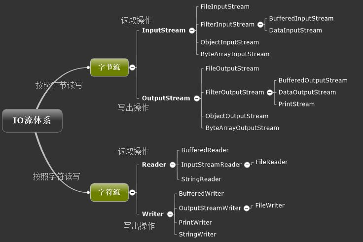

# Java IO包
Java IO包提供的工具类用于与操作系统交互来完成磁盘读写和网络读写。它的核心概念是stream，stream有以下几个特点：
1. 单向读写，即一个stream要么用于写数据，要么用于读数据，不能同时完成这两项工作。
2. 阻塞线程，即读写过程中，当前线程被阻塞。
3. stream之间可以嵌套，以提供更方便的交互方式。

简易IO流体系介绍图

## InputStream 与 OutputStream
在IO包中有很多stream，有一些的主要工作是面向操作系统实现不同类型的IO的具体操作，有一些的主要工作是面向数据提供多样的处理数据的方式。

### 第一类---面向操作系统
    FileInputStream：本地磁盘输入流。
    FileOutputStream：本地磁盘输出流。
    SocketInputStream：TCP输入流。
    SocketOutputStream：TCP输出流。
Java使用DatagramSocket代表UDP协议的Socket，DatagramSocket本身只是码头，不维护状态，不能产生IO流，所以它并不在Java IO体系中。

### 第二类---面向数据
    BufferedInputStream/BufferedOutputStream：对于stream的读写添加缓存，一次性读取/写入大量数据，减少与操作系统通讯的次数，提高读写速度。
    InputStreamReader/OutputStreamWriter：实现以字符的方式读/写数据。stream只能以字节或者字节数组的方式读/写数据。
    BufferedReader/BufferedWriter：同时具备以上两种特点。
以上只是列举几个常用的，实际上有特别多。这些stream是嵌套使用的，带Buffered前缀的需要用相对应的stream或者reader来生成，reader需要用stream来生成。这些都不能直接产生。

